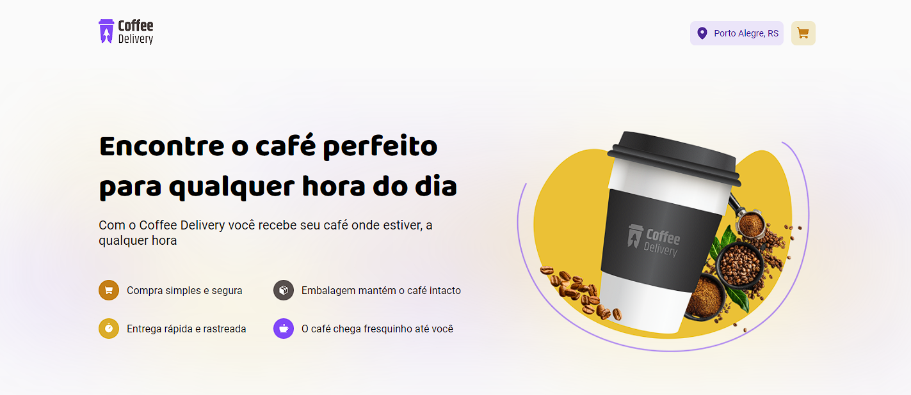
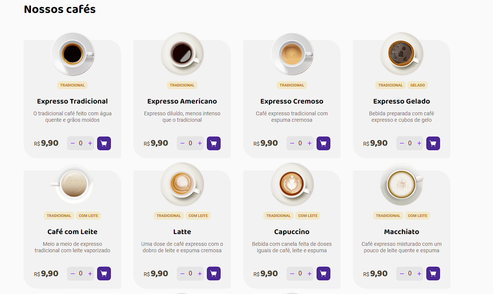
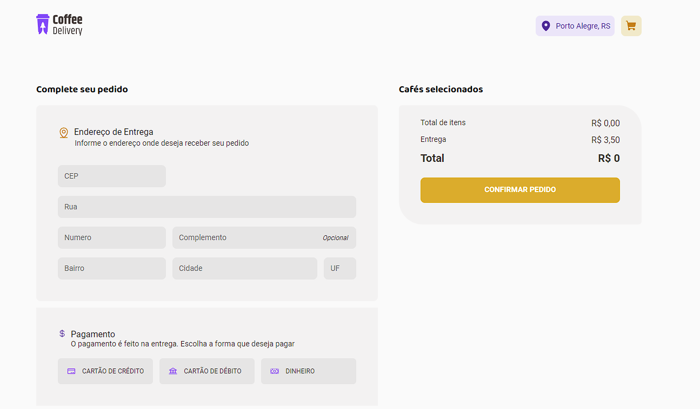

</div>

## ▶ Preview

[](https://coffe-delivery-gamma.vercel.app/)

## 📃 About

Coffe Delivery, é um projeto de uma cafeteria fictícia, em que é possivel gerenciar o seu carrinho de compras adicionando ou removendo os itens, além de, um formulário para informar o metodo de pagamento e o indereço de entrega da compra.

## 🎨 Layout

- [Layout Figma - Original](https://www.figma.com/file/0pdPfesf9HkadGrSukBqfA/Coffee-Delivery-Copy?fuid=849842337339839423)

## 🛠 Build with

- [HTML]()
- [CSS]()
- [TypeScript]()

## 🎞 Demo





## ⚙ Features


## 💻 Getting started

```sh
git clone hhttps://github.com/GuiOrlandin/Coffe-Delivery.git && cd 
Coffe-Delivery
```

Download [live server](https://marketplace.visualstudio.com/items?itemName=ritwickdey.LiveServer) extension on vscode and run.